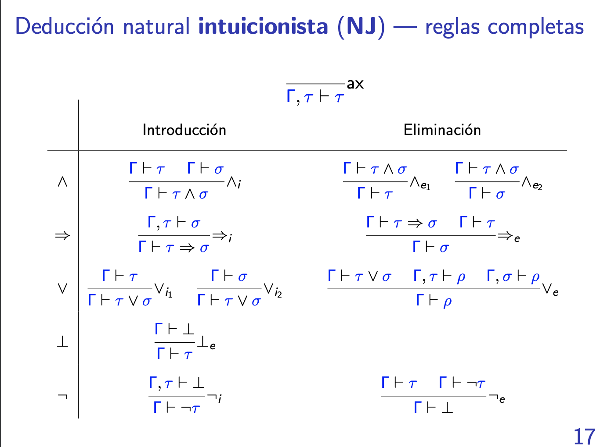
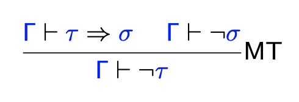
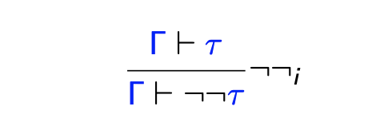
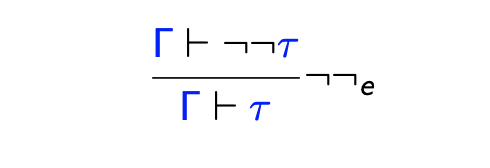

# Teórica 3 - 06 de Septiembre

# **Sistemas deductivos**

## Sistemas deductivos

Queremos poder hacer **afirmaciones matemáticamente precisas** sobre programas en distintos lenguajes de programación.

Queremos tener mecanismos para demostrar dichas afirmaciones.
En este contexto, las afirmaciones se llaman **juicios**.

Un sistema deductivo sirve para razonar acerca de juicios.

Está dado por **reglas de inferencia**.

Las reglas que no tienen premisas (n = 0) se llaman **axiomas**.

Las premisas son **condiciones suficientes** para la conclusión.

- Lectura de arriba hacia abajo: si tenemos evidencia de que valen las premisas,
podemos deducir que vale la conclusión.

- Lectura de abajo hacia arriba: si queremos demostrar que vale la conclusión,
alcanza con demostrar que valen las premisas.

Una **derivación** es un árbol finito formado por reglas de inferencia. Parte de ciertas premisas y llega a una conclusión.

Un juicio es **derivable** si hay alguna derivación sin premisas que lo concluye.

Suponemos dado un conjunto infinito de variables proposicionales:

`P = {P, Q, R, ...}`

El siguiente sistema predica sobre juicios de la forma “X form”.

## Deducción natural para lógica proposicional

### Fórmulas de la lógica proposicional

Las fórmulas son las expresiones que se pueden generar a partir de la siguiente gramática:

### Observación

La gramáticas definen sistemas deductivos de manera abreviada.

Una expresión `τ` se puede generar a partir de la gramática de arriba si y sólo si el juicio `τ` form es derivable en el sistema de antes.

### Convenciones de notación

1. Omitimos los paréntesis más externos de las fórmulas.
`τ ∧ ¬(σ ∨ ρ) = (τ ∧ ¬(σ ∨ ρ))`
2. La implicación es asociativa a derecha.
`τ ⇒ σ ⇒ ρ = (τ ⇒ (σ ⇒ ρ))`
3. Ojo: los conectivos `(∧, ∨)` no son conmutativos ni asociativos.
`τ ∨ (σ ∨ ρ) ̸= (τ ∨ σ) ∨ ρ τ ∧ σ ̸= σ ∧ τ`

### Contextos y juicios

Un contexto es un conjunto finito de fórmulas.

Los notamos con letras griegas mayúsculas (`Γ, ∆, Σ, ...`).

Por ejemplo: `Γ = {P ⇒ Q, ¬Q}`

Generalmente omitimos las llaves; p. ej.: `P ⇒ Q, ¬Q`.

El sistema de deducción natural predica sobre juicios de la forma:

`Γ ⊢ τ`

Informalmente, un juicio afirma que a partir de las hipótesis en el contexto `Γ` es posible deducir la fórmula de la tesis.

Por ejemplo, los siguientes van a ser juicios derivables:

`P ⇒ Q ⊢ ¬Q ⇒ ¬P P, Q ∧ R ⊢ R ∧ P`

### Reglas de inferencia — axioma

El sistema de deducción natural tiene muchas reglas de inferencia.

#### Axioma

### Reglas de inferencia — conjunción

Introducción y eliminación de la conjunción.

### Reglas de inferencia — implicación

Introducción y eliminación (*modus ponens*) de la implicación.

### Reglas de inferencia — disyunción

Introducción y eliminación de la disyunción.

### Reglas de inferencia — falsedad

El conectivo `⊥` representa la falsedad (contradicción, absurdo).
El conectivo `⊥` no tiene reglas de introducción.

*ex falso quodlibet*

### Reglas de inferencia — negación

Introducción y eliminación de la negación.

### Deducción natural intuicionista

### Propiedades del sistema

**Teorema (Debilitamiento)**

Si `Γ ⊢ τ` es derivable, entonces `Γ, σ ⊢ τ` es derivable.

*Modus tollens*

**Introducción de la doble negación**

### Principios de razonamiento clásicos

#### Eliminación de la doble negación

#### Principio del tercero excluido

#### Reducción al absurdo clásico

### Lógica intuicionista vs. lógica clásica

**Dos sistemas deductivos**

NJ sistema de deducción natural intuicionista.
NK sistema de deducción natural clásica.

- NK extiende a NJ con principios de razonamiento clásicos.
Alcanza con agregar uno de ellos, por ejemplo `¬¬e` .
- Si un juicio es derivable en NJ, también es derivable en NK.
- NJ es más restrictiva. No permite usar `¬¬e` , LEM, PBC, etc.
- Para hacer matemática, comúnmente usamos lógica clásica.
Interés de la lógica intuicionista en computación
- Permite razonar acerca de información.
¿Qué significa (`hay vida en Marte ∨ ¬hay vida en Marte`)?
- Las derivaciones en NJ se pueden entender como programas.
NJ es la base de un lenguaje de programación funcional.

### Deducción natural clásica (NK) — reglas completas

## Semántica bivaluada

### Valuaciones

Una valuación es una función `v : P → {V, F}` que asigna valores de
verdad a las variables proposicionales.

Una valuación `v` satisface una fórmula `τ` si `v ⊨ τ` , donde:

- `v ⊨ P si y sólo si v(P) = V`
- `v ⊨ τ ∧ σ si y sólo si v ⊨ τ y v ⊨ σ`
- `v ⊨ τ ⇒ σ si y sólo si v ⊭ τ o v ⊨ σ`
- `v ⊨ τ ∨ σ si y sólo si v ⊨ τ o v ⊨ σ`
- `v ⊨ ⊥` nunca vale
- `v ⊨ ¬τ` si y sólo `si v ⊭ τ`

Una valuación v satisface un contexto `Γ` (notación: `v ⊨ Γ`) si y sólo si `v` satisface a todas las fórmulas de `Γ`.

Un contexto `Γ` satisface una fórmula `τ` (notación: `Γ ⊨ τ`) si y sólo si cualquier valuación `v` que satisface a `Γ` también satisface a `τ`.

### Corrección y completitud

Teorema

Son equivalentes:
1. `Γ ⊢ τ` es derivable en NK.
2. `Γ ⊨ τ`

### Demostración de corrección (`Γ ⊢NK τ` implica `Γ ⊨ τ`)

### Demostración de completitud (`Γ ⊨ τ` implica `Γ ⊢NK τ`)

### Demostración de completitud (`Γ ⊨ τ` implica `Γ ⊢NK τ`)

### Demostración del lema principal
