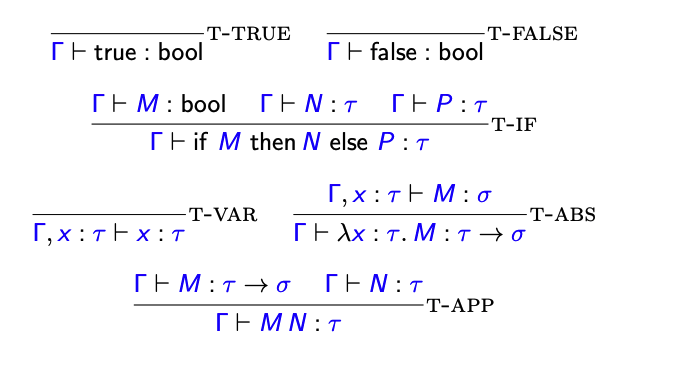
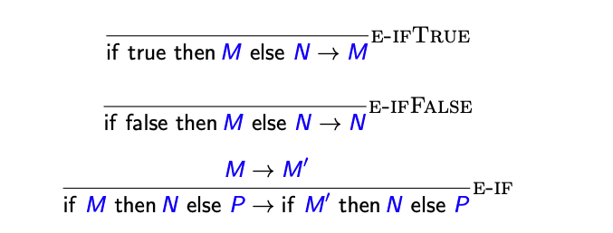
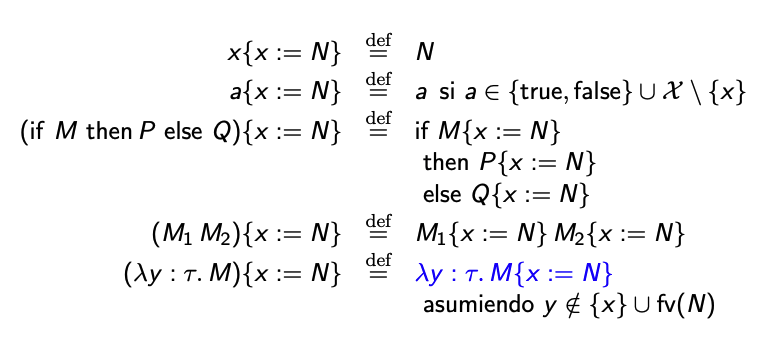

# Teórica 5 - 20 de Septiembre

# **Cálculo λ**

## Introducción

### ¿Qué es el cálculo-λ?

Lenguaje de programación definido de manera rigurosa.

Se basa sólo en dos operaciones: construir funciones y aplicarlas.

**Históricamente**
- Concebido en la década de 1930 por Alonzo Church para formalizar la noción de función efectivamente computable.
- Usado desde la década de 1960 para estudiar semántica formal de lenguajes de programación.

**Actualmente**
- Núcleo de lenguajes de programación funcionales y asistentes
de demostración. *Lisp, OCaml, Haskell, Coq, Agda, Lean, ...*
- Laboratorio para investigar nuevas características de lenguajes.
- Fuertemente conectado con la teoría de la demostración, matemática constructiva, teoría de categorías, ...

## Cálculo λ - Sintaxis y tipado

**Sintaxis de los tipos**

`τ , σ, ρ, ... ::= bool
                | τ → σ`

Asumimos que el constructor de tipos “`→`” es asociativo a derecha:

`τ → σ → ρ = τ → (σ → ρ) ̸= (τ → σ) → ρ`

Suponemos dado un conjunto infinito numerable de variables:

`X = {x, y, z, ...}`

**Sintaxis de los términos**

`M, N, P, ... ::= x variable
                | λx : τ . M            abstracción
                | M N                   aplicación
                | true                  verdadero
                | false                 falso
                | if M then N else P    condicional`

Asumimos que la aplicación es asociativa a izquierda:

`M N P = (M N) P ̸= M (N P)`

La abstracción y el “if” tienen menor precedencia que la aplicación:

`λx : τ. M N = λx : τ.(M N) ̸= (λx : τ. M) N`

Ejemplos de términos

- `λx : bool. x`
- `λx : bool → bool. x`
- `(λx : bool. x) false`
- `(λx : bool → bool. x) (λy : bool. y)`
- `(λx : bool. λy : bool → bool. y x) true`
- `λx : bool. if x then false else true`
- `true true`
- `if λx : bool. x then false else true`

### Variables libres y ligadas

Una ocurrencia de x está ligada si aparece adentro de una abstracción “`λ x`”. Una ocurrencia de x está libre si no está ligada.

**Alfa equivalencia**

Los términos que difieren sólo en el nombre de variables ligadas se consideran iguales:

`λx : τ. λy : σ. x = λy : τ. λx : σ. y = λa : τ. λb : σ. a
λx : τ. λy : σ. x ̸= λx : τ. λy : σ. y = λx : τ. λx : σ. x`

### Sistema de tipos

La noción de “tipabilidad” se formaliza con un sistema deductivo.

**Contextos de tipado**

Un contexto de tipado es un conjunto finito de pares `(xi : τi)`:
`{x1 : τ1, ... , xn : τn}`
sin variables repetidas `(i ̸= j ⇒ xi ̸= xj)`.

Se nota con letras griegas mayúsculas (`Γ`, `∆`, ...).

A veces notamos `dom(Γ) = {x1, ... , xn}`.

**Juicios de tipado**

El sistema de tipos predica sobre juicios de tipado, de la forma:
`Γ ⊢ M : τ`

Reglas de tipado

#### Propiedades del sistema de tipos

**Teorema (Unicidad de tipos)**

Si `Γ ⊢ M : τ y Γ ⊢ M : σ` son derivables, entonces `τ = σ`.

**Teorema (Weakening + Strengthening)**

Si `Γ ⊢ M : τ` es derivable y `fv(M) ⊆ dom(Γ ∩ Γ′)` entonces `Γ′ ⊢ M : τ` es derivable.

## Cálculo λ - Semántica operacional

El sistema de tipos indica cómo se construyen los programas.

Queremos además darles significado (semántica).

Distintas maneras de dar semántica formal

1. Semántica operacional.
Indica cómo se ejecuta el programa hasta llegar a un resultado.
Semántica *small-step*: ejecución paso a paso.
Semántica *big-step*: evaluación directa al resultado.

2. Semántica denotacional.
Interpreta los programas como objetos matemáticos.

3. Semántica axiomática.
Establece relaciones lógicas entre el estado del programa antes
y después de la ejecución.

Vamos a trabajar con semántica operacional *small-step*.

### Semántica operacional *small-step*

**Programas**

Un programa es un término `M` tipable y cerrado `(fv(M) = ∅)`:
- El juicio de tipado `⊢ M : τ` debe ser derivable para algún `τ`.

**Juicios de evaluación**

La semántica operacional predica sobre juicios de evaluación:
`M → N`
donde `M` y `N` son programas.

**Valores**

Los valores son los posibles resultados de evaluar programas:
`V ::= true | false | λx : τ. M`

**Reglas de evaluación para expresiones booleanas**

Ejemplo
1. Derivar el siguiente juicio:
`if (if false then false else true) then false else true
→ if true then false else true`
2. ¿Para qué términos `M` vale que `true → M`?
3. ¿Es posible derivar el siguiente juicio?
`if true then (if false then false else false) else true
→ if true then false else true`

Reglas de evaluación para funciones (abstracción y aplicación)

### Sustitución

La operación de sustitución:
`M{x := N}`
denota el término que resulta de reemplazar todas las ocurrencias libres de `x` en `M` por `N`.

Definición de sustitución

Definición de sustitución alternativa

### Propiedades de la evaluación

**Teorema (Determinismo)**

Si `M → N1` y `M → N2` entonces `N1 = N2`.

**Teorema (Preservación de tipos)**

Si `⊢ M : τ` y `M → N` entonces `⊢ N : τ`.

**Teorema (Progreso)**

Si `⊢ M : τ` entonces:
1. O bien `M` es un valor.
2. O bien existe `N` tal que `M → N`.

**Teorema (Terminación)**

Si `⊢ M : τ`, entonces no hay una cadena infinita de pasos:
`M → M1 → M2 → ...`

**Corolario (Canonicidad)**

1. Si `⊢ M : bool` es derivable, entonces la evaluación de `M` termina y el resultado es true o false.
2. Si `⊢ M : τ → σ` es derivable, entonces la evaluación de `M` termina y el resultado es una abstracción.

**Slogan**
*Well typed programs cannot go wrong.* (Robin Milner)
